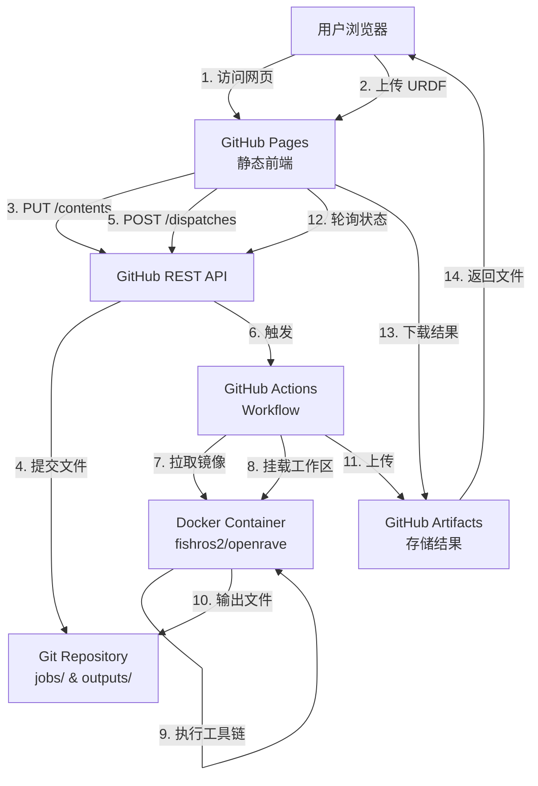

# Design Document: IKFast Online Generator

## Overview

IKFast Online Generator 是一个无服务器的 Web 应用，利用 GitHub 生态系统（GitHub Pages + GitHub Actions）实现 IKFast 逆运动学求解器的自动化生成。系统采用前后端分离架构，前端为纯静态 HTML/CSS/JavaScript 应用，后端通过 GitHub Actions 在 Docker 容器中执行 OpenRAVE/IKFast 工具链。

### 核心设计原则

1. **零服务器成本**：完全依赖 GitHub 免费服务
2. **安全隔离**：所有用户文件在 Docker 容器中处理
3. **可追溯性**：完整记录每次生成过程
4. **用户友好**：无需本地环境配置，纯浏览器操作

### 技术栈

- **前端**: 原生 JavaScript (ES6+), HTML5, CSS3
- **托管**: GitHub Pages (静态站点)
- **后端**: GitHub Actions (workflow automation)
- **执行环境**: Docker (fishros2/openrave 镜像)
- **API**: GitHub REST API v3
- **版本控制**: Git

## Architecture

### 系统架构图



### 数据流

1. **上传阶段**
   - 用户选择 URDF 文件 → 前端验证 → GitHub API 提交 → 存储到 `jobs/current/robot.urdf`

2. **链接信息获取阶段**
   - 触发 workflow (info mode) → Docker 执行 `openrave-robot.py --info links` → 解析输出 → 前端展示

3. **生成阶段**
   - 用户配置参数 → 触发 workflow (generate mode) → Docker 执行完整工具链 → 生成 `ikfast_solver.cpp` → 上传 Artifact

4. **监控阶段**
   - 前端轮询 workflow 状态 → 获取日志 → 实时展示

5. **下载阶段**
   - Workflow 完成 → 前端获取 Artifact URL → 用户下载文件

### 安全边界

- **信任边界**: 用户浏览器 ↔ GitHub API (HTTPS + Token 认证)
- **隔离边界**: GitHub Actions Runner ↔ Docker Container (容器隔离)
- **权限边界**: GitHub Token 仅授予 `repo` 和 `actions:write` 权限

## Components and Interfaces

### 1. Frontend Application (静态网页)

#### 1.1 FileUploadComponent

**职责**: 处理 URDF 文件选择和上传

**接口**:
```javascript
class FileUploadComponent {
  // 选择文件
  selectFile(fileInputElement) -> File
  
  // 验证文件
  validateFile(file) -> {valid: boolean, error: string}
  
  // 上传到 GitHub
  async uploadToGitHub(file, token, repo) -> {success: boolean, sha: string}
}
```

**验证规则**:
- 文件扩展名必须为 `.urdf`
- 文件大小 ≤ 10MB
- 文件内容必须为有效 XML

**GitHub API 调用**:
```http
PUT /repos/{owner}/{repo}/contents/jobs/current/robot.urdf
Authorization: Bearer {token}
Content-Type: application/json

{
  "message": "Upload URDF file",
  "content": "{base64_encoded_content}",
  "sha": "{previous_file_sha_if_exists}"
}
```

#### 1.2 LinkInfoComponent

**职责**: 展示机器人链接信息，辅助用户选择 base_link 和 ee_link

**接口**:
```javascript
class LinkInfoComponent {
  // 触发链接信息获取
  async fetchLinkInfo(token, repo) -> WorkflowRun
  
  // 解析链接信息
  parseLinkInfo(logContent) -> Link[]
  
  // 渲染链接表格
  renderLinkTable(links) -> HTMLElement
  
  // 处理链接选择
  onLinkSelect(linkIndex, targetField) -> void
}
```

**Link 数据结构**:
```javascript
interface Link {
  index: number;
  name: string;
  parent: string | null;
  isRoot: boolean;      // 无父节点
  isLeaf: boolean;      // 无子节点
}
```

**链接信息解析逻辑**:
- 从 `openrave-robot.py --info links` 输出中提取
- 输出格式示例:
  ```
  name index parents
  base_link 0 
  link1 1 base_link(0)
  link2 2 link1(1)
  ```
- 正则表达式: `/^(\S+)\s+(\d+)\s*(.*?)$/`

#### 1.3 ParameterConfigComponent

**职责**: 配置 IKFast 生成参数

**接口**:
```javascript
class ParameterConfigComponent {
  // 验证参数
  validateParameters(params) -> {valid: boolean, errors: string[]}
  
  // 获取参数
  getParameters() -> IKFastParameters
  
  // 设置默认值
  setDefaults() -> void
}
```

**IKFastParameters 数据结构**:
```javascript
interface IKFastParameters {
  baseLink: number;        // 基座链接索引
  eeLink: number;          // 末端执行器链接索引
  ikType: string;          // IKFast 类型
}
```

**IKType 选项**:
```javascript
const IK_TYPES = [
  {value: 'transform6d', label: '6D Transform (默认)', description: '完整的位置和姿态'},
  {value: 'translation3d', label: '3D Translation', description: '仅位置，无姿态约束'},
  {value: 'direction3d', label: '3D Direction', description: '方向向量'},
  {value: 'ray4d', label: '4D Ray', description: '射线（原点+方向）'},
  {value: 'lookat3d', label: '3D Look-At', description: '注视点'},
  {value: 'translationdirection5d', label: '5D Translation+Direction', description: '位置+方向'},
  {value: 'translationxy5d', label: '5D Translation XY', description: 'XY平面位置+姿态'}
];
```

**验证规则**:
- `baseLink` 和 `eeLink` 必须为非负整数
- `baseLink` ≠ `eeLink`
- `ikType` 必须在预定义列表中

#### 1.4 WorkflowTriggerComponent

**职责**: 触发 GitHub Actions workflow

**接口**:
```javascript
class WorkflowTriggerComponent {
  // 触发 workflow
  async triggerWorkflow(token, repo, workflowId, inputs) -> {runId: number}
  
  // 检查是否有运行中的 workflow
  async hasActiveWorkflow(token, repo) -> boolean
}
```

**GitHub API 调用**:
```http
POST /repos/{owner}/{repo}/actions/workflows/{workflow_id}/dispatches
Authorization: Bearer {token}
Content-Type: application/json

{
  "ref": "main",
  "inputs": {
    "mode": "generate",
    "base_link": "1",
    "ee_link": "8",
    "iktype": "transform6d"
  }
}
```

#### 1.5 StatusMonitorComponent

**职责**: 监控 workflow 执行状态

**接口**:
```javascript
class StatusMonitorComponent {
  // 开始轮询
  startPolling(runId, interval = 5000) -> void
  
  // 停止轮询
  stopPolling() -> void
  
  // 获取运行状态
  async getRunStatus(token, repo, runId) -> WorkflowRunStatus
  
  // 更新 UI
  updateStatusDisplay(status) -> void
}
```

**WorkflowRunStatus 数据结构**:
```javascript
interface WorkflowRunStatus {
  id: number;
  status: 'queued' | 'in_progress' | 'completed';
  conclusion: 'success' | 'failure' | 'cancelled' | null;
  createdAt: string;
  updatedAt: string;
  htmlUrl: string;
}
```

**轮询策略**:
- 初始间隔: 5 秒
- 最大间隔: 30 秒（指数退避）
- 超时时间: 30 分钟
- 状态为 `completed` 时停止轮询

**GitHub API 调用**:
```http
GET /repos/{owner}/{repo}/actions/runs/{run_id}
Authorization: Bearer {token}
```

#### 1.6 LogViewerComponent

**职责**: 展示实时日志

**接口**:
```javascript
class LogViewerComponent {
  // 获取日志
  async fetchLogs(token, repo, runId) -> string
  
  // 追加日志
  appendLog(content) -> void
  
  // 清空日志
  clearLog() -> void
  
  // 自动滚动
  scrollToBottom() -> void
  
  // 高亮 STEP 标记
  highlightSteps(logContent) -> HTMLElement
}
```

**日志格式化**:
- 保留 ANSI 颜色代码（使用 ansi-to-html 库或自定义解析）
- 识别 STEP 标记并高亮显示
- 错误信息使用红色
- 成功信息使用绿色
- 时间戳使用灰色

**日志获取方式**:
1. 通过 GitHub Actions API 获取 job logs
2. 或从 Artifact 中下载 `build.log` 文件

```http
GET /repos/{owner}/{repo}/actions/runs/{run_id}/logs
Authorization: Bearer {token}
```

#### 1.7 DownloadComponent

**职责**: 处理结果文件下载

**接口**:
```javascript
class DownloadComponent {
  // 获取 Artifact 列表
  async listArtifacts(token, repo, runId) -> Artifact[]
  
  // 下载 Artifact
  async downloadArtifact(token, repo, artifactId) -> Blob
  
  // 触发浏览器下载
  triggerDownload(blob, filename) -> void
}
```

**Artifact 数据结构**:
```javascript
interface Artifact {
  id: number;
  name: string;
  sizeInBytes: number;
  url: string;
  expiresAt: string;
}
```

**GitHub API 调用**:
```http
GET /repos/{owner}/{repo}/actions/runs/{run_id}/artifacts
Authorization: Bearer {token}

GET /repos/{owner}/{repo}/actions/artifacts/{artifact_id}/zip
Authorization: Bearer {token}
```

**下载流程**:
1. 获取 Artifact 列表
2. 找到名为 `ikfast-result` 的 Artifact
3. 下载 ZIP 文件
4. 解压并提取 `ikfast_solver.cpp` 和 `build.log`
5. 使用 `Blob` 和 `URL.createObjectURL` 触发浏览器下载

#### 1.8 AuthenticationManager

**职责**: 管理 GitHub API 认证

**接口**:
```javascript
class AuthenticationManager {
  // 获取 Token（从环境变量或用户输入）
  getToken() -> string
  
  // 验证 Token
  async validateToken(token) -> {valid: boolean, scopes: string[]}
  
  // 设置 Token
  setToken(token) -> void
}
```

**Token 存储策略**:
- **选项 1**: 前端不存储 Token，使用 GitHub OAuth App 进行授权
- **选项 2**: 用户手动输入 Personal Access Token，存储在 `sessionStorage`
- **选项 3**: 使用 GitHub App，Token 通过后端代理（需要额外服务）

**推荐方案**: 选项 2（用户输入 PAT）
- 简单直接，无需额外服务
- 用户完全控制权限
- Token 仅存储在 session 中，关闭浏览器即失效

**所需权限**:
- `repo` (读写仓库内容)
- `workflow` (触发 workflow)

### 2. GitHub Actions Workflow

#### 2.1 Workflow 文件结构

**文件路径**: `.github/workflows/ikfast.yml`

```yaml
name: IKFast Generator

on:
  workflow_dispatch:
    inputs:
      mode:
        description: 'Execution mode'
        required: true
        type: choice
        options:
          - info
          - generate
      base_link:
        description: 'Base link index'
        required: false
        type: string
      ee_link:
        description: 'End effector link index'
        required: false
        type: string
      iktype:
        description: 'IKFast solver type'
        required: false
        type: string
        default: 'transform6d'

jobs:
  ikfast:
    runs-on: ubuntu-latest
    timeout-minutes: 30
    
    steps:
      - name: Checkout repository
        uses: actions/checkout@v3
      
      - name: Validate inputs
        run: |
          if [ "${{ inputs.mode }}" = "generate" ]; then
            if [ -z "${{ inputs.base_link }}" ] || [ -z "${{ inputs.ee_link }}" ]; then
              echo "Error: base_link and ee_link are required for generate mode"
              exit 1
            fi
          fi
      
      - name: Run IKFast in Docker
        run: |
          mkdir -p outputs
          
          if [ "${{ inputs.mode }}" = "info" ]; then
            # 仅获取链接信息
            sudo docker run --rm \
              -v ${GITHUB_WORKSPACE}:/ws \
              -w /ws \
              fishros2/openrave bash -c "
                set -e
                {
                  echo '=== STEP 1: URDF to Collada ==='
                  rosrun collada_urdf urdf_to_collada jobs/current/robot.urdf robot.dae
                  
                  echo '=== STEP 2: Extract Link Information ==='
                  openrave-robot.py robot.dae --info links
                  
                  echo '=== INFO MODE COMPLETE ==='
                } 2>&1 | tee outputs/info.log
              "
          else
            # 完整生成流程
            sudo docker run --rm \
              -v ${GITHUB_WORKSPACE}:/ws \
              -w /ws \
              fishros2/openrave bash -c "
                set -e
                {
                  echo '=== STEP 1: URDF to Collada ==='
                  rosrun collada_urdf urdf_to_collada jobs/current/robot.urdf robot.dae
                  
                  echo '=== STEP 2: Verify Collada File ==='
                  ls -lh robot.dae
                  
                  echo '=== STEP 3: Generate IKFast Solver ==='
                  python \`openrave-config --python-dir\`/openravepy/_openravepy_/ikfast.py \
                    --robot=robot.dae \
                    --iktype=${{ inputs.iktype }} \
                    --baselink=${{ inputs.base_link }} \
                    --eelink=${{ inputs.ee_link }} \
                    --savefile=outputs/ikfast_solver.cpp
                  
                  echo '=== STEP 4: Verify Output ==='
                  ls -lh outputs/ikfast_solver.cpp
                  wc -l outputs/ikfast_solver.cpp
                  
                  echo '=== GENERATION COMPLETE ==='
                } 2>&1 | tee outputs/build.log
              "
          fi
      
      - name: Upload artifacts
        uses: actions/upload-artifact@v3
        if: always()
        with:
          name: ikfast-result
          path: outputs/
          retention-days: 7
```

#### 2.2 Workflow 执行模式

**Info Mode** (mode=info):
- 仅执行 URDF → Collada 转换
- 提取并输出链接信息
- 不需要 base_link 和 ee_link 参数
- 输出: `outputs/info.log`

**Generate Mode** (mode=generate):
- 执行完整工具链
- 需要所有参数
- 输出: `outputs/ikfast_solver.cpp` 和 `outputs/build.log`

#### 2.3 Docker 容器配置

**镜像**: `fishros2/openrave`

**包含组件**:
- ROS Noetic
- OpenRAVE 0.9+
- collada_urdf 工具
- Python 2.7 (OpenRAVE 依赖)
- IKFast Python 脚本

**挂载点**:
- Host: `${GITHUB_WORKSPACE}` → Container: `/ws`
- 工作目录: `/ws`

**执行权限**:
- 使用 `sudo docker run` 确保有权限访问 Docker socket
- 容器内以 root 运行（OpenRAVE 需要）

### 3. Data Models

#### 3.1 前端状态管理

```javascript
// 全局应用状态
const AppState = {
  // 认证状态
  auth: {
    token: null,
    isAuthenticated: false,
    scopes: []
  },
  
  // 文件状态
  file: {
    uploaded: false,
    filename: null,
    size: 0,
    sha: null
  },
  
  // 链接信息
  links: [],
  
  // 参数配置
  parameters: {
    baseLink: null,
    eeLink: null,
    ikType: 'transform6d'
  },
  
  // Workflow 状态
  workflow: {
    runId: null,
    status: null,
    conclusion: null,
    startTime: null,
    endTime: null
  },
  
  // 日志
  logs: '',
  
  // Artifacts
  artifacts: []
};
```

#### 3.2 GitHub API 响应模型

**Workflow Run Response**:
```json
{
  "id": 1234567890,
  "name": "IKFast Generator",
  "status": "completed",
  "conclusion": "success",
  "workflow_id": 12345,
  "created_at": "2024-01-01T00:00:00Z",
  "updated_at": "2024-01-01T00:05:00Z",
  "html_url": "https://github.com/owner/repo/actions/runs/1234567890"
}
```

**Artifact Response**:
```json
{
  "total_count": 1,
  "artifacts": [
    {
      "id": 987654321,
      "name": "ikfast-result",
      "size_in_bytes": 1048576,
      "url": "https://api.github.com/repos/owner/repo/actions/artifacts/987654321",
      "archive_download_url": "https://api.github.com/repos/owner/repo/actions/artifacts/987654321/zip",
      "expired": false,
      "created_at": "2024-01-01T00:05:00Z",
      "expires_at": "2024-01-08T00:05:00Z"
    }
  ]
}
```

### 4. 错误处理策略

#### 4.1 前端错误分类

**网络错误**:
```javascript
class NetworkError extends Error {
  constructor(message, statusCode, response) {
    super(message);
    this.name = 'NetworkError';
    this.statusCode = statusCode;
    this.response = response;
  }
}
```

**验证错误**:
```javascript
class ValidationError extends Error {
  constructor(message, field, value) {
    super(message);
    this.name = 'ValidationError';
    this.field = field;
    this.value = value;
  }
}
```

**API 错误**:
```javascript
class GitHubAPIError extends Error {
  constructor(message, statusCode, apiMessage) {
    super(message);
    this.name = 'GitHubAPIError';
    this.statusCode = statusCode;
    this.apiMessage = apiMessage;
  }
}
```

#### 4.2 错误处理流程

```javascript
async function handleOperation(operation) {
  try {
    return await operation();
  } catch (error) {
    if (error instanceof NetworkError) {
      // 显示网络错误，提供重试按钮
      showError('网络连接失败，请检查网络后重试', {retry: true});
    } else if (error instanceof ValidationError) {
      // 高亮错误字段，显示验证消息
      highlightField(error.field);
      showError(error.message);
    } else if (error instanceof GitHubAPIError) {
      // 显示 API 错误详情
      showError(`GitHub API 错误 (${error.statusCode}): ${error.apiMessage}`);
      
      // 特殊处理常见错误
      if (error.statusCode === 401) {
        showError('认证失败，请检查 Token 权限');
      } else if (error.statusCode === 403) {
        showError('权限不足或 API 速率限制');
      } else if (error.statusCode === 404) {
        showError('资源未找到，请检查仓库配置');
      }
    } else {
      // 未知错误
      console.error('Unexpected error:', error);
      showError('发生未知错误，请查看控制台日志');
    }
  }
}
```

#### 4.3 Workflow 错误处理

**URDF 转换失败**:
- 捕获 `rosrun collada_urdf` 的 stderr
- 常见原因: URDF 格式错误、缺少 mesh 文件
- 解决建议: 验证 URDF 语法，确保所有引用的文件存在

**IKFast 生成失败**:
- 捕获 `ikfast.py` 的 stderr
- 常见原因: 
  - 链接索引超出范围
  - 运动链不满足 IKFast 要求（如非串联结构）
  - 求解器类型不适用于该机器人
- 解决建议: 检查链接选择，尝试不同的 iktype

**Docker 执行失败**:
- 捕获 Docker 错误
- 常见原因: 镜像拉取失败、权限不足
- 解决建议: 检查 GitHub Actions runner 状态

### 5. 性能优化

#### 5.1 前端优化

**文件上传优化**:
- 大文件分块上传（如果超过 1MB）
- 显示上传进度条
- 使用 `XMLHttpRequest` 或 `fetch` 的 `onprogress` 事件

**轮询优化**:
- 指数退避策略，避免频繁请求
- 使用 `AbortController` 支持取消请求
- 缓存已获取的日志内容，仅追加新内容

**UI 渲染优化**:
- 日志内容使用虚拟滚动（如果超过 10000 行）
- 防抖处理用户输入
- 使用 `requestAnimationFrame` 优化动画

#### 5.2 后端优化

**Docker 镜像缓存**:
- GitHub Actions runner 会缓存 Docker 镜像
- 首次运行较慢（拉取镜像），后续运行快速

**并发控制**:
- 使用 GitHub Actions 的 `concurrency` 配置
- 确保同一时间只有一个 workflow 运行

```yaml
concurrency:
  group: ikfast-generation
  cancel-in-progress: false
```

**Artifact 压缩**:
- GitHub 自动压缩 Artifact 为 ZIP
- 前端需要解压处理

## Correctness Properties

*A property is a characteristic or behavior that should hold true across all valid executions of a system—essentially, a formal statement about what the system should do. Properties serve as the bridge between human-readable specifications and machine-verifiable correctness guarantees.*


### Property 1: File Extension Validation
*For any* file selected by the user, the system should accept the file for upload if and only if the file extension is `.urdf`
**Validates: Requirements 1.1, 15.1**

### Property 2: File Size Validation
*For any* file uploaded by the user, the system should reject files larger than 10MB and accept files within the limit
**Validates: Requirements 13.1, 15.2**

### Property 3: XML Structure Validation
*For any* uploaded file, if the file content is not valid XML, the system should reject the upload and display a validation error
**Validates: Requirements 15.3**

### Property 4: GitHub API Upload Consistency
*For any* valid URDF file upload, the system should make a PUT request to the GitHub API with the file content base64-encoded, and the file should be retrievable from `jobs/current/robot.urdf`
**Validates: Requirements 1.2, 1.3**

### Property 5: Upload Progress Feedback
*For any* file upload operation, the system should emit progress events and update the UI to reflect upload progress
**Validates: Requirements 1.5**

### Property 6: Error Message Display
*For any* failed operation (API error, network error, validation error), the system should display an error message containing relevant error details to the user
**Validates: Requirements 1.4, 2.5, 7.5, 8.5, 9.1, 9.2, 9.3, 9.4**

### Property 7: Workflow Trigger on Upload
*For any* successful URDF file upload, the system should automatically trigger a workflow dispatch with mode="info" to extract link information
**Validates: Requirements 2.1**

### Property 8: Link Information Parsing
*For any* output from `openrave-robot.py --info links`, the system should parse and extract link index, name, and parent information for all links
**Validates: Requirements 2.3, 16.1**

### Property 9: Link Table Display
*For any* parsed link information, the system should render a table with columns for Index, Name, and Parent, and highlight root links (no parent) and leaf links (no children)
**Validates: Requirements 2.4, 16.2, 16.3, 16.4**

### Property 10: Link Selection Auto-fill
*For any* link row clicked by the user, the system should auto-fill the corresponding link index into the appropriate input field
**Validates: Requirements 16.5**

### Property 11: Parameter Validation
*For any* user input for base_link and ee_link, the system should accept only non-negative integers and reject all other inputs
**Validates: Requirements 3.2**

### Property 12: Invalid Parameter Rejection
*For any* parameter submission where base_link equals ee_link, or where iktype is not in the supported list, the system should prevent submission and display validation errors
**Validates: Requirements 3.5, 17.5**

### Property 13: Workflow Dispatch with Parameters
*For any* valid parameter set (base_link, ee_link, iktype), the system should trigger a workflow dispatch with mode="generate" and pass all parameters correctly
**Validates: Requirements 4.1, 4.4, 17.4**

### Property 14: Output File Generation
*For any* successfully completed workflow in generate mode, the system should produce an `ikfast_solver.cpp` file in the outputs directory with size greater than 0 bytes
**Validates: Requirements 4.5, 19.1, 19.2**

### Property 15: Build Log Generation
*For any* workflow execution (success or failure), the system should produce a `build.log` file containing all command outputs, timestamps, and final status
**Validates: Requirements 4.6, 14.1, 14.2, 14.3, 14.4, 14.5**

### Property 16: Workflow Failure Handling
*For any* workflow step that fails, the system should capture the error output, mark the workflow conclusion as "failure", and include the error in the build log
**Validates: Requirements 4.7**

### Property 17: Status Polling
*For any* triggered workflow, the system should poll the GitHub API for status updates at intervals of at least 5 seconds until the workflow reaches a terminal state (completed, failed, cancelled)
**Validates: Requirements 5.1, 5.2, 5.4, 13.4**

### Property 18: Status Display Mapping
*For any* workflow status retrieved from the API, the system should display one of the valid states: "queued", "in_progress", "completed", or "failed"
**Validates: Requirements 5.3**

### Property 19: Status Update Latency
*For any* workflow status change, the system should update the frontend display within 10 seconds of the change occurring
**Validates: Requirements 5.5**

### Property 20: Log Retrieval and Display
*For any* workflow that is running or completed, the system should retrieve the build.log content and display it in the log viewer
**Validates: Requirements 6.1**

### Property 21: Log Content Preservation
*For any* log content containing ANSI escape codes, the system should either preserve them or convert them to HTML formatting for display
**Validates: Requirements 6.2**

### Property 22: Log Step Highlighting
*For any* log content containing STEP markers (e.g., "=== STEP 1: ==="), the system should apply visual highlighting to make steps clearly identifiable
**Validates: Requirements 6.3**

### Property 23: Log Incremental Append
*For any* new log content retrieved during polling, the system should append it to the existing log display without clearing previous content
**Validates: Requirements 6.4**

### Property 24: Download Link Availability
*For any* successfully completed workflow, the system should provide enabled download links for both `ikfast_solver.cpp` and `build.log` files
**Validates: Requirements 7.1, 7.2, 12.6**

### Property 25: Artifact Download
*For any* download link clicked, the system should retrieve the corresponding file from GitHub Artifacts and trigger a browser download with the correct filename
**Validates: Requirements 7.3, 7.4**

### Property 26: API Authentication Headers
*For any* GitHub API request made by the system, the request should include an Authorization header with a valid token
**Validates: Requirements 8.4**

### Property 27: Error Styling Differentiation
*For any* error message displayed in the log viewer, the system should apply distinct visual styling (e.g., red color) to differentiate it from normal log output
**Validates: Requirements 9.5**

### Property 28: Retry Option for Network Errors
*For any* network error encountered, the system should provide a retry button or option to the user
**Validates: Requirements 9.4**

### Property 29: File Overwrite on Upload
*For any* new URDF file upload, the system should overwrite the previous file at `jobs/current/robot.urdf` rather than creating a new file
**Validates: Requirements 11.1**

### Property 30: Output Directory Storage
*For any* workflow completion, all generated files should be stored in the `outputs/` directory
**Validates: Requirements 11.2**

### Property 31: Single Active Job Constraint
*At any* point in time, there should be at most one file at `jobs/current/robot.urdf`, ensuring sequential processing
**Validates: Requirements 11.4**

### Property 32: Concurrent Workflow Prevention
*For any* user attempting to trigger a new workflow, if a workflow is currently running, the system should disable the submit button and display a message indicating a workflow is in progress
**Validates: Requirements 18.4, 18.5**

### Property 33: Workflow Queue Position Display
*For any* workflow in "queued" status, the system should display the queue position to the user if available from the API
**Validates: Requirements 18.3**

### Property 34: File Integrity Verification
*For any* generated `ikfast_solver.cpp` file, if the file is missing or has 0 bytes, the system should mark the workflow as failed and display an error
**Validates: Requirements 19.4**

### Property 35: File Size Display
*For any* available download, the system should display the file size in human-readable format (e.g., "1.2 MB")
**Validates: Requirements 19.3**

### Property 36: Checksum Logging
*For any* generated `ikfast_solver.cpp` file, the system should compute and include a checksum (e.g., SHA256) in the build log
**Validates: Requirements 19.5**

### Property 37: IKType Description Display
*For any* iktype option in the dropdown, the system should display a brief description explaining what that solver type does
**Validates: Requirements 17.2**

### Property 38: Technical Term Tooltips
*For any* technical term displayed in the UI (e.g., "Base Link", "End Effector Link", "IKType"), the system should provide a tooltip or help icon with an explanation
**Validates: Requirements 20.3**

### Property 39: Quota Warning Display
*When* the GitHub Actions minutes quota is approaching the limit (e.g., >80% used), the system should display a warning message to the user
**Validates: Requirements 13.5**

### Property 40: Container Cleanup
*For any* Docker container execution, after the workflow completes (success or failure), the container should be removed and temporary files cleaned up
**Validates: Requirements 10.5**

## Error Handling

### Error Categories

1. **Client-Side Validation Errors**
   - Invalid file extension
   - File size exceeds limit
   - Invalid XML structure
   - Invalid parameter values (non-integer, negative, base==ee)
   - Missing required fields

2. **Network Errors**
   - Connection timeout
   - DNS resolution failure
   - Network unreachable
   - Request aborted

3. **GitHub API Errors**
   - 401 Unauthorized: Invalid or expired token
   - 403 Forbidden: Insufficient permissions or rate limit exceeded
   - 404 Not Found: Repository or resource not found
   - 422 Unprocessable Entity: Invalid request payload
   - 500+ Server Errors: GitHub service issues

4. **Workflow Execution Errors**
   - URDF to Collada conversion failure (invalid URDF, missing meshes)
   - OpenRAVE link extraction failure (unsupported robot structure)
   - IKFast generation failure (invalid kinematic chain, unsupported iktype)
   - Docker execution failure (image pull error, container crash)
   - Timeout (workflow exceeds 30 minutes)

5. **Artifact Errors**
   - Artifact not found (workflow didn't upload)
   - Artifact expired (beyond retention period)
   - Download failure (network error during download)

### Error Handling Strategies

**Validation Errors**: 
- Prevent submission
- Highlight invalid fields
- Display inline error messages
- Provide correction guidance

**Network Errors**:
- Display error with retry button
- Implement exponential backoff for retries
- Show connection status indicator

**API Errors**:
- Parse error response and display meaningful message
- For 401/403: Prompt user to check token permissions
- For 404: Verify repository configuration
- For 429: Display rate limit message and wait time
- For 5xx: Suggest trying again later

**Workflow Errors**:
- Display full error output from OpenRAVE/IKFast
- Highlight error lines in log viewer
- Provide troubleshooting suggestions based on error patterns
- Link to documentation for common issues

**Artifact Errors**:
- Check workflow status before attempting download
- Display clear message if artifact is missing
- Provide link to workflow run for debugging

### Error Recovery

- All errors should be recoverable without page refresh
- Failed uploads can be retried
- Failed workflows can be re-triggered with adjusted parameters
- Network errors automatically retry with backoff
- User can always return to initial state and start over

## Testing Strategy

### Dual Testing Approach

This system requires both **unit tests** and **property-based tests** for comprehensive coverage:

- **Unit tests**: Verify specific examples, edge cases, UI interactions, and integration points
- **Property tests**: Verify universal properties across all inputs using randomized testing

### Unit Testing

**Frontend Components** (JavaScript/Jest):

1. **FileUploadComponent**
   - Test file selection with valid .urdf file
   - Test rejection of non-.urdf files
   - Test rejection of files > 10MB
   - Test rejection of invalid XML
   - Test GitHub API call with correct parameters
   - Test error handling for API failures

2. **LinkInfoComponent**
   - Test parsing of sample link info output
   - Test rendering of link table
   - Test highlighting of root and leaf links
   - Test auto-fill on link selection

3. **ParameterConfigComponent**
   - Test validation of integer inputs
   - Test rejection of negative numbers
   - Test rejection when base_link == ee_link
   - Test iktype dropdown options
   - Test default value setting

4. **WorkflowTriggerComponent**
   - Test workflow dispatch API call
   - Test parameter passing
   - Test prevention of concurrent workflows

5. **StatusMonitorComponent**
   - Test polling start/stop
   - Test status mapping
   - Test polling interval (>= 5 seconds)
   - Test timeout handling

6. **LogViewerComponent**
   - Test log appending (not clearing)
   - Test STEP highlighting
   - Test ANSI code handling
   - Test auto-scrolling

7. **DownloadComponent**
   - Test artifact listing
   - Test artifact download
   - Test ZIP extraction
   - Test browser download trigger

**Integration Tests**:
- Test complete workflow from upload to download
- Test error recovery flows
- Test concurrent user simulation

### Property-Based Testing

**Testing Library**: Use **fast-check** for JavaScript property-based testing

**Configuration**: Each property test should run a minimum of **100 iterations**

**Property Test Examples**:

```javascript
// Property 1: File Extension Validation
fc.assert(
  fc.property(fc.string(), (filename) => {
    const isUrdf = filename.endsWith('.urdf');
    const result = validateFileExtension(filename);
    return result.valid === isUrdf;
  }),
  { numRuns: 100 }
);
// Tag: Feature: ikfast-online-generator, Property 1: File extension validation

// Property 8: Link Information Parsing
fc.assert(
  fc.property(
    fc.array(fc.record({
      name: fc.string(),
      index: fc.nat(),
      parent: fc.option(fc.string())
    })),
    (links) => {
      const output = generateLinkInfoOutput(links);
      const parsed = parseLinkInfo(output);
      return parsed.length === links.length &&
             parsed.every((p, i) => p.index === links[i].index);
    }
  ),
  { numRuns: 100 }
);
// Tag: Feature: ikfast-online-generator, Property 8: Link information parsing

// Property 11: Parameter Validation
fc.assert(
  fc.property(fc.anything(), (input) => {
    const result = validateLinkIndex(input);
    const isValid = Number.isInteger(input) && input >= 0;
    return result.valid === isValid;
  }),
  { numRuns: 100 }
);
// Tag: Feature: ikfast-online-generator, Property 11: Parameter validation

// Property 17: Status Polling Interval
fc.assert(
  fc.property(fc.nat(1000), async (runId) => {
    const monitor = new StatusMonitor();
    const timestamps = [];
    monitor.onPoll = () => timestamps.push(Date.now());
    
    monitor.startPolling(runId);
    await sleep(15000);
    monitor.stopPolling();
    
    // Check all intervals are >= 5000ms
    for (let i = 1; i < timestamps.length; i++) {
      if (timestamps[i] - timestamps[i-1] < 5000) {
        return false;
      }
    }
    return true;
  }),
  { numRuns: 100 }
);
// Tag: Feature: ikfast-online-generator, Property 17: Status polling interval

// Property 23: Log Incremental Append
fc.assert(
  fc.property(
    fc.array(fc.string()),
    (logChunks) => {
      const viewer = new LogViewer();
      let accumulated = '';
      
      for (const chunk of logChunks) {
        viewer.appendLog(chunk);
        accumulated += chunk;
      }
      
      return viewer.getContent() === accumulated;
    }
  ),
  { numRuns: 100 }
);
// Tag: Feature: ikfast-online-generator, Property 23: Log incremental append
```

### GitHub Actions Workflow Testing

**Workflow Validation**:
- Validate YAML syntax
- Test with sample URDF files
- Test both info and generate modes
- Test error scenarios (invalid URDF, invalid parameters)
- Verify artifact upload
- Verify log completeness

**Docker Container Testing**:
- Verify fishros2/openrave image availability
- Test URDF to Collada conversion
- Test link info extraction
- Test IKFast generation with various iktypes
- Test error handling in container

### End-to-End Testing

**Manual Testing Scenarios**:
1. Upload valid URDF → View links → Generate solver → Download result
2. Upload invalid URDF → Verify error display
3. Upload valid URDF → Select invalid parameters → Verify validation
4. Trigger workflow → Monitor status → View logs → Download files
5. Test with various robot types (6-DOF, 7-DOF, different structures)
6. Test with different iktypes
7. Test concurrent access (multiple browser tabs)
8. Test network error recovery
9. Test with expired/invalid GitHub token

**Automated E2E Tests** (Playwright/Cypress):
- Simulate complete user workflows
- Test UI interactions
- Verify API calls are made correctly
- Test error states and recovery

### Test Coverage Goals

- **Unit Test Coverage**: > 80% code coverage
- **Property Test Coverage**: All 40 properties implemented
- **Integration Test Coverage**: All major workflows covered
- **E2E Test Coverage**: All user-facing scenarios covered

### Continuous Integration

- Run unit tests on every commit
- Run property tests on every PR
- Run E2E tests before deployment
- Validate workflow YAML on changes
- Test with multiple browser versions

## Deployment and Operations

### Deployment Process

1. **Frontend Deployment** (GitHub Pages):
   - Push to `main` branch
   - GitHub automatically builds and deploys to Pages
   - No build step required (pure static files)
   - URL: `https://{username}.github.io/{repo-name}/`

2. **Workflow Deployment**:
   - Workflow file changes are effective immediately after push
   - No separate deployment step
   - Test workflows in a separate branch before merging

### Configuration

**Required GitHub Settings**:
- Enable GitHub Pages (source: `main` branch, `/web` directory or root)
- Enable GitHub Actions
- Set repository visibility (public or private with appropriate token permissions)

**Required Secrets** (if using GitHub App):
- `GITHUB_TOKEN`: Automatically provided by GitHub Actions
- Or custom PAT with `repo` and `workflow` scopes

**Frontend Configuration** (config.js):
```javascript
const CONFIG = {
  GITHUB_OWNER: 'shine-tong',
  GITHUB_REPO: 'ikfast-online',
  WORKFLOW_FILE: 'ikfast.yml',
  POLLING_INTERVAL: 5000,  // ms
  MAX_FILE_SIZE: 10 * 1024 * 1024,  // 10MB
  WORKFLOW_TIMEOUT: 30 * 60 * 1000,  // 30 minutes
};
```

### Monitoring

**Metrics to Track**:
- Workflow success rate
- Average workflow duration
- File upload success rate
- API error rates
- GitHub Actions minutes usage

**Logging**:
- Frontend: Browser console logs (development only)
- Backend: Complete logs in build.log artifact
- GitHub Actions: Workflow run logs

### Maintenance

**Regular Tasks**:
- Monitor GitHub Actions minutes quota
- Review failed workflows and identify patterns
- Update Docker image if OpenRAVE/ROS updates available
- Clean up old artifacts (automatic after retention period)
- Update documentation based on user feedback

**Troubleshooting**:
- Check GitHub Actions status page for service issues
- Verify Docker image availability
- Review workflow logs for errors
- Test with known-good URDF files
- Verify GitHub token permissions

### Scalability Considerations

**Current Limitations**:
- Sequential workflow execution (one at a time)
- GitHub Actions minutes quota (2000 minutes/month for free tier)
- Artifact storage limits (500MB per artifact, 2GB total for free tier)
- API rate limits (5000 requests/hour for authenticated requests)

**Scaling Options**:
- Upgrade to GitHub Pro/Team for more Actions minutes
- Implement workflow prioritization
- Add caching for frequently used URDF files
- Optimize Docker image size for faster pulls
- Implement result caching (same URDF + parameters = cached result)

### Security Considerations

**Threat Model**:
- Malicious URDF files (XML bombs, XXE attacks)
- Token theft or exposure
- Unauthorized workflow triggers
- Resource exhaustion attacks

**Mitigations**:
- Docker container isolation
- XML parsing with entity expansion limits
- Token stored in sessionStorage (not localStorage)
- Workflow timeout limits
- File size limits
- Rate limiting via GitHub API
- No arbitrary code execution

**Security Best Practices**:
- Use HTTPS for all communications
- Validate all user inputs
- Sanitize log outputs before display
- Regular security audits of dependencies
- Keep Docker image updated
- Monitor for suspicious activity

## Future Enhancements

### Potential Features

1. **Result Caching**:
   - Cache generated solvers for identical URDF + parameters
   - Reduce redundant computations
   - Faster results for common robots

2. **URDF Visualization**:
   - Display 3D visualization of robot model
   - Highlight selected base_link and ee_link
   - Interactive link selection

3. **Batch Processing**:
   - Upload multiple URDF files
   - Generate solvers for multiple parameter combinations
   - Download results as ZIP

4. **User Accounts**:
   - Save upload history
   - Manage multiple projects
   - Share results with team

5. **Advanced Validation**:
   - Semantic URDF validation
   - Kinematic chain analysis
   - Suggest optimal iktype based on robot structure

6. **Performance Optimization**:
   - Parallel workflow execution (with concurrency limits)
   - Incremental log streaming (WebSocket)
   - Progressive result download

7. **Integration**:
   - Direct integration with MoveIt Setup Assistant
   - Export to ROS package format
   - Integration with robot simulation tools

8. **Analytics**:
   - Usage statistics dashboard
   - Popular robot models
   - Success/failure trends
   - Performance metrics

### Technical Debt

- Replace sessionStorage token with OAuth flow
- Implement proper frontend state management (Redux/Zustand)
- Add comprehensive error boundary components
- Improve accessibility (ARIA labels, keyboard navigation)
- Add internationalization support
- Optimize bundle size (code splitting, lazy loading)
- Add service worker for offline support
- Implement proper logging infrastructure

## Conclusion

This design provides a complete architecture for the IKFast Online Generator platform, leveraging GitHub's infrastructure to deliver a zero-cost, secure, and user-friendly solution for generating IKFast solvers. The system is designed with correctness, security, and user experience as primary concerns, with comprehensive testing strategies to ensure reliability.

The modular component design allows for incremental development and testing, while the property-based testing approach ensures correctness across a wide range of inputs. The error handling strategy provides clear feedback to users and enables recovery from failures without requiring page refreshes.

Future enhancements can build upon this solid foundation to add more advanced features while maintaining the core principles of simplicity, security, and zero operational cost.
